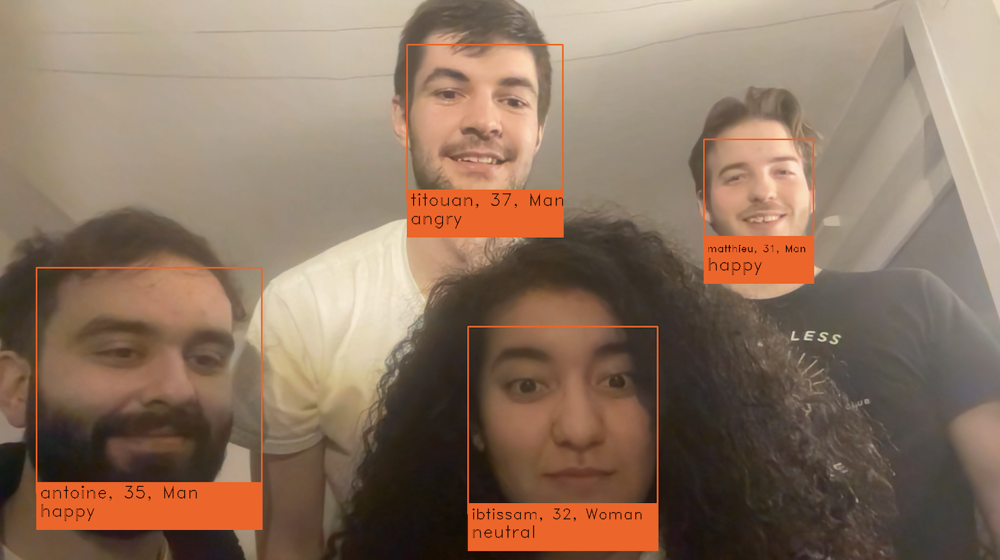

# Challenge Web Mining - ImageSpeechRecognition

### Key words 
Voice recognition - Face recognition - Emotion, gender, age detection - Deep Learning

### Summary
We had 2 days to create a streamlit app. The goal is to control the webcam of our computer by voice (start/stop the webcam and/or the recording). Once the camera is activated, it is able to identify the people in our database, as well as detect their gender, age, and emotions in real time.

## Objectif de ce repository

Ce repository présente comment utiliser l'application Streamlit. Les commandes vocales ne peuvent pas être hebergées sur Docker. L'application avec commande vocale n'est donc disponible que localement.

## 1. Lancer l'application localement

* Importer le projet en local via zip (à dézipper) ou git clone

* La librairie 'dlib' dont nous avons besoin rencontre généralement quelques problèmes lors du téléchargement. Voici un tutoriel qui devrait vous permettre de l'installer : https://www.youtube.com/watch?v=ALKggf-Mwmo

* Installer ensuite le reste des dépendances avec la commande : pip install -r requirements.txt. 

* Dans un terminal, se positionner dans le dossier "ImageSpeechRecognition" avec la commande cd <chemin de votre projet>

* Lancer l'application avec la commande : python -m streamlit app.py

* Après avoir lancé ces commandes, l'application s'ouvre, ou vous pouvez ouvrir l'application sur : localhost:8501

## 2. Présentation de l'application streamlit

Lorsque vous arrivez sur l'application, vous pouvez appuyer sur "Lancer la reconnaissance vocale" afin d'activer celle-ci. Pour activer la webcam, il faut prononcer le mot "Démarrer" (vous pouvez aussi prononcer une phrase qui contient le mot "démarrer", cela fonctionne aussi). Celle-ci met plusieurs secondes avant de s'activer, il faut un peu de patience.  Afin d'arrêter la webcam il faut prononcer le mot "arrêter". Lorsque la webcam est active, vous pouvez lancer un enregistrement en prononçant le mot "enregistrer", et stopper celui-ci avec le mot "stopper". A droite de l'écran s'affichent les mots que l'appareil a entendus, ainsi que ses réponses (par exemple, s'il a entendu le mot démarrer, il va répondre "la caméra démarre")
Vous pouvez directement consulter vos vidéos enregistrées dans l'onglet "Recordings".

### Prédiction des visages, de l'âge, du sexe et des émotions

Voici un exemple de ce que l'application pourra vous affichez lorsque la caméra est lancée.

### Résumé des commandes vocales

* **Démarrer** pour démarrer la webcam
* **Enregistrer** pour commencer un enregistrement
* **Stopper** pour stopper l'enregistrement
* **Arrêter** pour arrêter la webcam

A noter qu'il faut stopper l'enregistrement avant d'arrêter la webcam si vous voulez que celui-ci fonctionne.

## 3. Programmes et outils utilisés

Pour la reconnaissance faciale, nous utilisons entre autres la librairie DeepFace de Pypi, qui est un framework de reconnaissance faciale hybride renfermant divers modèles de réseaux de neurones dont VGG-Face, ainsi que les librairies face_recognition et OpenCV.
Pour la reconnaissance vocale, nous utilisons surtout la librairie speech_recognition. La notion de threading (programmation parallèle) nous a été très utile pour paralléliser les reconnaissances faciale et vocale, pour que nous puissions lancer des commandes vocales tout en gardant la webcam activée.
